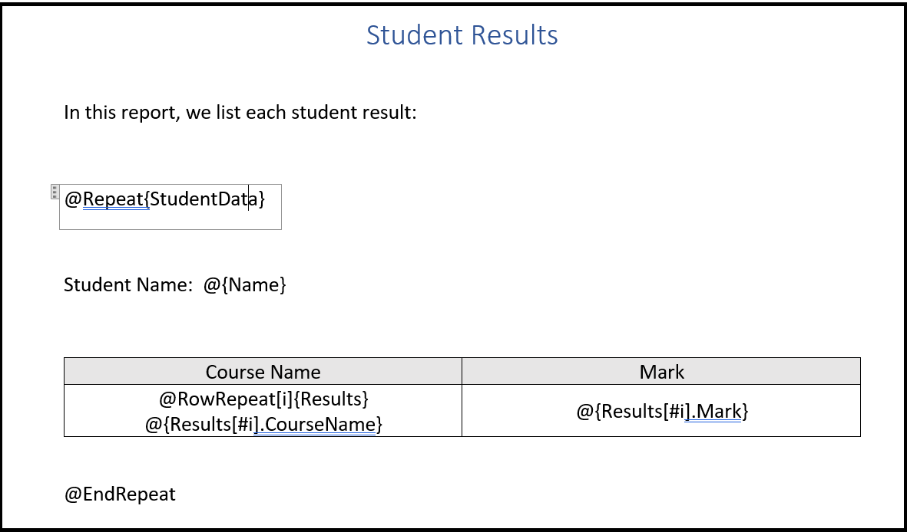
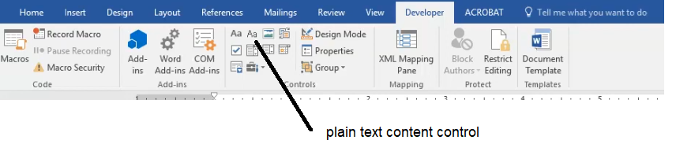
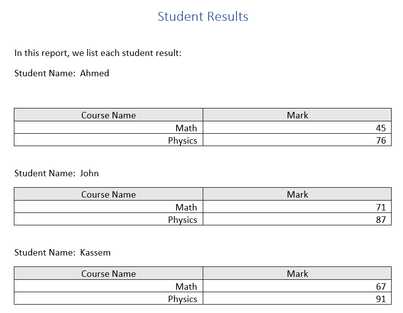

# DocX Generator

## 1. Overview

DocX Generator generates reports in the form of word files based on template file. The template is a normal word file that is easy to edit and design. The template file is filled with data. The data is assumed to exist in Json data format; thus allowing complex data layout to be mapped to the report.
The template is designed by inserting directives inside label elements.

You can help me continue maintaining and developing this project by making a donation.
[
  ![Donate with PayPal]
  (docs/images/paypal-donate-button.png)
]
(https://paypal.me/MohamedHamdy1984?country.x=EG&locale.x=en_US)

## 2. Quickstart
Let's assume that we have some data about students and their course results.

    {
    "StudentData": [
        {
            "Name": "Ahmed",
            "Results": [
                {
                    "CourseName": "Math",
                    "Mark": 45
                },
                {
                    "CourseName": "Physics",
                    "Mark": 76
                }
            ]
        },
        {
            "Name": "John",
            "Results": [
                {
                    "CourseName": "Math",
                    "Mark": 71
                },
                {
                    "CourseName": "Physics",
                    "Mark": 87
                }
            ]
        },
        {
            "Name": "Kassem",
            "Results": [
                {
                    "CourseName": "Math",
                    "Mark": 67
                },
                {
                    "CourseName": "Physics",
                    "Mark": 91
                }
            ]
        }
    ]
    }

Let's save this json data in a file named 'data.json'. Next step is to open Microsoft Word and write a template file for our report:

We utilize directives to control how the template file is filled with data. Each directive should be written inside a plain text content control as shown in the figure below:

The '@Repeat' directive instructs DocXGenerator to repeat its content for each element of the array 'StudentData'. The body of the '@Repeat' directive is contained in the area between '@Repeat' and '@EndRepeat'.

The data is bound using the binding directive '@{bindingExpression}'. For example, '@{Name}' binds the property Name of each StudentData element.

Binding list of data items to a table is very common situation. We provide the user with two directives to achieve that '@RowRepeat' and '@ColRepeat'. Each of them is bound to an array. You should specify an index variable in the '@RowRepeat' or the '@ColRepeat' directives. The index variable is used to specify an element in the array. For example '@{Results[#i].CourseName}' specifies the CourseName of element i in the Results array. 

Final step is to write C# code that consumes the template and json data and produce the report.

    using ReportComposer;
    using System.Text.Json;
    using System.Text.Json.Nodes;

    var jsonData = System.IO.File.ReadAllText(@"data.json");

    var json = JsonSerializer.Deserialize<JsonNode>(jsonData);

    if (json != null && json is JsonObject data)
    {
    	WordComposer composer = new WordComposer(@"template.docx", data);

    	composer.SaveToFile(@"result.docx");
    }

Upon execution of the above code, we get the report file result.docx filled with data. as shown below:

## 3. Template Directives

The directives are commands inserted into the template word file to specify how to bind data, loop through data list, or customize certain behavior.
In the following, we explain each template directive:

### 3.1 Binding directive

The binding directive is written as '@{bindingExpression}'. The *bindingExpression* locates a certain Json memeber field. The value of the data field addressed by the bindingExpression is copied to the output report.

### 3.2 Repeat directive

The repeat directive is a scoped directive. You start the repeat scope 
with the begining directive '@Repeat{listName}' and close the repeat scope with the '@EndRepeat' directive.

Inside the repeat scope you can use the binding directive or any other directive 
to map data to the output report. Once you are inside the repeat scope, you
don't need to specify the full member name of the data field. The data field is specified relative to each list item.

### 3.3 Context directive

The context directive is used to simplify writing of binding expressions. 
The context directive is a scoped directive. You can start the scope by the '@Context{bindingExpression}' and terminate the scope by the '@EndContext' directive.
Inside the context directive scope, you can use binding expressions relative to the context 
binding expression. You can specify a name to the binding expression using the syntax 
'@Context[contextName]{bindingExpression}'.

### 3.4 Table directives

Tables are essential components of any report. A table presents a list of data items. A list of json data could be mapped to rows or columns of a table. Sometimes, it is also necessary to customize the style of the table. 
We provide a powerful style control technique by allowing template writer to show/hide certain rows or columns.

#### 3.4.1 Row repeat directive

The row repeat directive maps a list of json data elements to table rows. The directive is 
written as '@RowRepeat[indexVariable]{bindingExpression}'. The template writer should create a table and create a template row inside the table.
The row repeat directive can be placed inside any cell of the template row.
The binding expression should point to a Json array element. 

After placing the row repeat directive inside the template cell, you can place binding directives in row cells. You specify an index variable to address the array element in binding expressions. The index variable is used to select an element from the expanded bound list. The index variable should be specified in binding expressions precedded by '#'. For example, if you insert the directive '@RowRepeat[i]{dataArray}' inside a table template row,
you can write the binding expressions in other row cells as '@{dataArray[#i].Name}'.

Note that the row repeat directive doesn't update the binding context. i.e. you should write binding expressions relative to the innermost context directive.  

#### 3.4.2 Column repeat directive

The column repeat directive is similar to row repeat directive. It maps a list of json data elements to table columns. The directive is 
written as '@ColRepeat[indexVariable]{bindingExpression}'. The template writer should create a table and create a template column inside the table.
The column repeat directive can be placed inside any cell of the template column.
The binding expression should point to a Json array element. 

After placing the column repeat directive inside the template cell, you can place binding directives in column cells. You specify an index variable to address the array element in binding expressions. The index variable is used to select an element from the expanded bound list. The index variable should be specified in binding expressions precedded by '#'. For example, if you insert the directive '@ColRepeat[i]{dataArray}' inside a table template column,
you can write the binding expressions in other column cells as '@{dataArray[#i].Name}'.

Note that the column repeat directive doesn't update the binding context. i.e. you should write binding expressions relative to the innermost context directive.  

#### 3.4.3 Row show/hide directives

The row show/hide directives can be used to conditionally structure a table. These directives shows/hides a certain row based on boolean flag. The difference between them is that row show directive keeps the row visible if the
controlling flag is true while the row hide directive hides the row if the controlling flag is true. 
The row show directive is written as '@RowShow{bindingExpression}' while row hide directive is 
written as '@RowHide{bindingExpression}'. The binding expression should point to a boolean Json member.

#### 3.4.4 Column show/hide directives

The column show/hide directives can be used to conditionally structure a table. These directives shows/hides a
certain column based on boolean flag. The difference between them is that column show directive keeps the column visible if the
controlling flag is true while the column hide directive hides the column if the controlling flag is true. 
The column show directive is written as '@ColShow{bindingExpression}' while col hide directive is 
written as '@ColHide{bindingExpression}'. The binding expression should point to a boolean Json memeber.

## 4. Binding Expressions

You can use binding expressions inside binding directive to locate a certain Json member field.
The binding expression may contain array indexing such as '@{list[8]}' or object member access using the dot operator such as '@{obj.Name}'. The binding expression may also contain an index variable such as '@{data[#i].Name}'. The index variable is used in template rows or columns. The index variable '#i' is replaced in each row/column by the row/column index.

Complex binding expressions can be written using a composite of indexing operator and dot operator such as '@{data[3].studentList[#i].Name}'.

You can specify a context name to evaluate the binding expression against it. The context should have been named in its declaration. For example, if you declared a context with name 'myContext' you can specify binding expressions with respect to it by writing '@[myContext]{bindingExpression}'.

